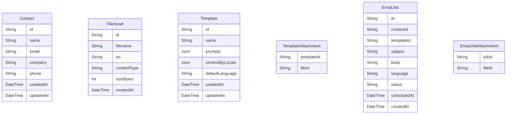

# Mail Assistant Architecture

## Overview

The mail assistant is a full‑stack web application that centralizes contact management, reusable assets, and AI assisted email workflows. The system targets multilingual teams (English, Indonesian, Italian) and supports bulk outreach via third‑party mail providers.

## Stack Choices

- **Framework:** Next.js 14 (App Router, TypeScript) for a hybrid SSR/SPA experience, fast forms, and easy API routes.
- **Styling/UI:** Tailwind CSS with Headless UI components to accelerate accessible UI development.
- **State/Data Fetching:** Server Actions for mutations, React Query (TanStack Query) for client caching of frequently accessed data (contacts, files, templates).
- **Database:** Prisma ORM with SQLite for local development and PostgreSQL in production. Prisma gives type‑safe access and migrations.
- **Authentication:** NextAuth.js with email/passkey adapters (placeholder until auth provider is chosen).
- **Internationalization:** `next-intl` with namespaces for `en`, `id`, and `it`. Content strings live under `app/(i18n)/locales/<lang>.json`.
- **File Storage:** Uploads routed through UploadThing (or S3 compatible storage) with signed URLs. Local development uses filesystem mock storage.
- **AI Drafting:** Server Action invoking Claude (Anthropic) via API; abstraction layer allows swapping providers if needed.
- **Email Delivery:** Resend SDK for transactional/bulk mail delivery. Abstraction layer (`MailProvider` interface) enables swapping to other ESPs.
- **CSV Processing:** `Papaparse` for client preview, server side validation before bulk insert.
- **Form Handling:** Zod schemas shared across client/server for validation.

## Key Modules

1. **Contacts**
   - CRUD endpoints + server actions.
   - Bulk import pipeline: client upload CSV → server parses into staging table → validation → insertion.
   - Export route returning CSV download.
2. **File Library**
   - Upload handler storing metadata in `FileAsset` table.
   - Attachments tracked via join tables for emails/templates.
3. **Templates**
   - Template metadata (name, description, context, example prompts).
   - Default attachments via join to `FileAsset`.
   - Versioning column for future audit trails.
4. **Compose Workflow**
   - Select contact + template.
   - Prefetch template context, attachments, example prompt.
   - Trigger Claude drafting (subject/body) using selected language.
   - Manual edits supported; attachments configurable.
   - Email send enqueues job with provider + status tracking.
5. **Automation/Form Intake**
   - Public form page capturing lead info, optional follow-up plan.
   - Optional auto-send of welcome email via chosen template.

## Localization Strategy

- All UI strings stored in locale JSON files.
- Database text content has `language` column; templates can store localized copies or share base content with translations.
- AI prompt builder injects localized strings and contact data; Claude request includes `targetLanguage`.
- Date/time/number formatting handled through `Intl` wrappers.

## Data Model (initial draft)

## Development Tooling

- ESLint + Prettier (Next.js defaults).
- Playwright for end-to-end tests of Compose flow.
- Vitest for isolated utility and server action tests.
- Storybook for iterating on complex UI (file library, compose panel).
- Commit hooks via Husky + lint-staged.

## Deployment Notes

- Recommend Vercel for web hosting + serverless API routes.
- PostgreSQL via Neon or Supabase.
- File storage via S3-compatible bucket (R2/S3/Wasabi).
- Background jobs (bulk sends) can be orchestrated with Vercel Cron or a lightweight queue (Upstash QStash).

## Next Steps

1. Scaffold Next.js project with the outlined tooling.
2. Configure Prisma schema + migrations.
3. Implement localization scaffolding and sample translations.
4. Build foundational pages: Contacts, Files, Templates, Compose, Intake Form.
5. Integrate mail provider + AI drafting service.
